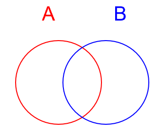

## 单集合模型

把一个格子及周围的8个格子看成一个集合S,f(S)表示该集合中的雷数,|S|表示集合中格子的数量,显然$0<=f(S)<=|S|$

## 双集合模型

双集合模型指使用任意两个集合进行判别。除单集合模型外,任何复杂形式的局面都是双集合模型的组合或拆分
  
令A和B来代表这两个集合,f(A)和f(B)分别代表两个集合中的雷数,假设$f(A) \geq f(B)$

### 引理

双集合模型中两个集合雷数的差值全部来自于两个集合与对方的差集,这是显然的,因为交集的雷数是公共的,差异只能来自于各自独自的部分(A和B的差集就是A中有而B中没有的,表示为$A-B$)  
数学表达式为 $f(A)-f(B)=f(A-B)-f(B-A)$  
证明很简单:  
$$f(A)=f(A-B)+f(A \cap B)$$
$$f(B)=f(B-A)+f(A \cap B)$$
相减得到$f(A)-f(B)=f(A-B)-f(B-A)$

### 相等公式

相等公式是引理中的特殊形式。如果两个集合雷数差值为0,可得他们两个各自独享区域雷数肯定相同  
11定式就是对称公式的一个特殊形式  
数学表达式为: $f(A)-f(B)=f(A-B)-f(B-A)=0$  
显然: $ f(A)=f(B) \iff f(A-B)=f(B-A)$

### 减法公式

减法公式同样也是引理的特殊形式。即两个集合雷数的差值为两个集合元素数量的差值,可得小的集合独自的区域全部不是雷,大的格子独自的区域全部都是雷  
数学表达式为:$f(A)-f(B)=|A-B| \iff f(A-B)=|A-B|,f(B-A)=0$  
证明$\Rightarrow:$  
由引理可得$$f(A)-f(B)=f(A-B)-f(B-A)=|A-B|$$
$$|A-B|=f(A-B)-f(B-A) \leq |A-B|-f(B-A)$$
可得$f(B-A) \leq 0,又因为f(B-A) \geq 0$  
所以$f(B-A)=0,自然f(A-B)=|A-B|$  
证明$\Leftarrow:$  
带入引理即可
